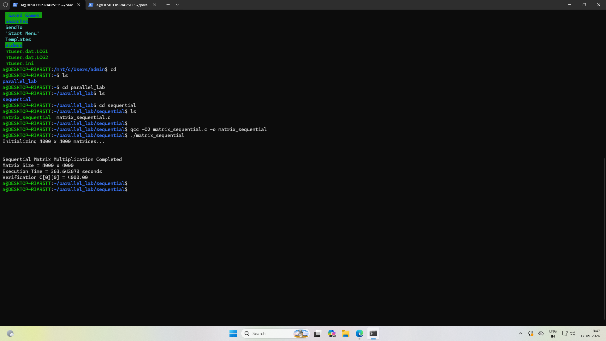
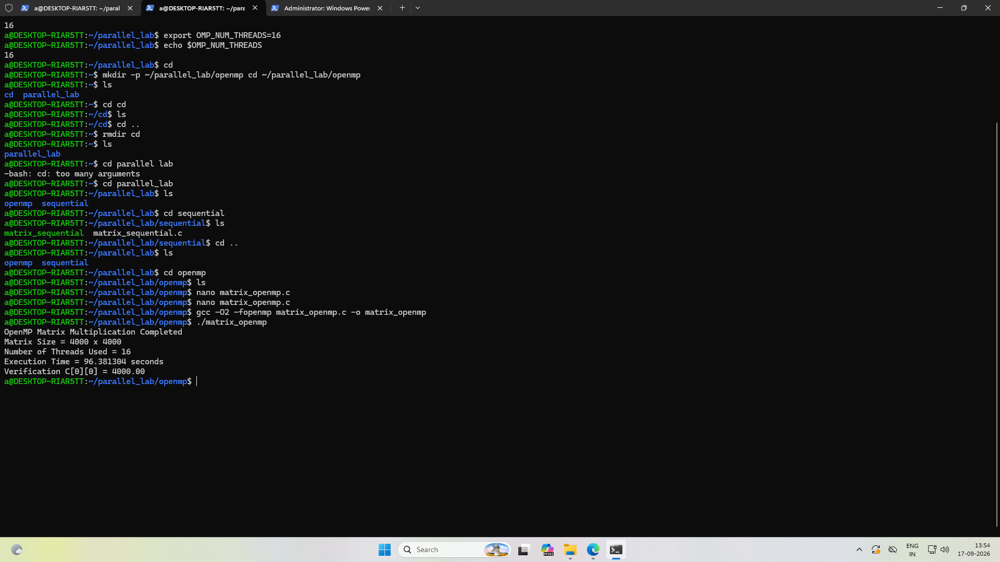
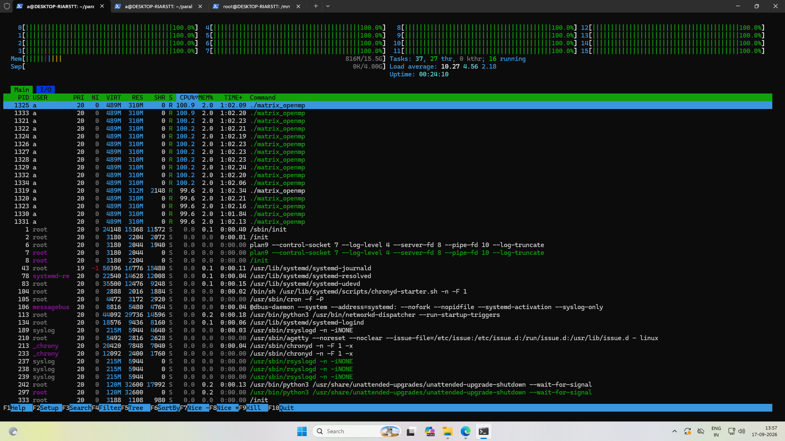
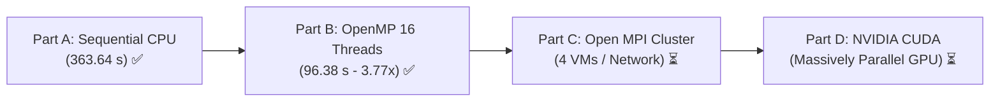

# Parallel and Distributed Computing (PGC) Lab
## Experiment 1: Matrix Multiplication using Sequential, OpenMP, MPI, and CUDA

**Student USN / Roll Number:** `01FE24BCI081`  
**Repository:** [https://github.com/akaraj187/PGC-Lab](https://github.com/akaraj187/PGC-Lab)  
**Lab Manual Reference:** `docs/Experiment_1_Parallel_Matrix_Multiplication_Lab_Manual_REFERENCE_FORMAT.docx`

---

## 📌 Executive Summary & Progress Tracker

This repository documents the comprehensive experimental analysis for **Experiment 1: Parallel Matrix Multiplication ($4000 \times 4000$)** comparing four core computing paradigms:
1. **Sequential CPU Execution** *(Baseline)*
2. **OpenMP Shared-Memory Parallelism** *(Multi-threading)*
3. **Open MPI Distributed-Memory Computing** *(Cluster/Multi-VM)*
4. **NVIDIA CUDA GPU Acceleration** *(Massively Parallel)*

| Part | Paradigm | Model | Status | Threads / Nodes | Execution Time | Speedup | Verification $C[0][0]$ |
| :--- | :--- | :--- | :---: | :---: | :---: | :---: | :---: |
| **Part A** | **Sequential** | Single-core CPU Baseline | **COMPLETED** ✅ | 1 Core | **363.642678 s** | **1.00×** | `4000.00` |
| **Part B** | **OpenMP** | Shared-Memory Multi-core | **COMPLETED** ✅ | 16 Threads | **96.381304 s** | **3.77×** | `4000.00` |
| **Part C** | **Open MPI** | Distributed-Memory Cluster | *In Progress* ⏳ | 4 VMs / Ranks | *Pending* | *TBD* | `4000.00` |
| **Part D** | **CUDA** | GPU Hardware Acceleration | *In Progress* ⏳ | 16M GPU Threads | *Pending* | *TBD* | `4000.00` |

---

## 📐 Problem Definition & Mathematical Formulation

Matrix multiplication of two square dense matrices $A, B \in \mathbb{R}^{N \times N}$ yielding matrix $C \in \mathbb{R}^{N \times N}$:

$$C_{i,j} = \sum_{k=0}^{N-1} A_{i,k} \cdot B_{k,j} \quad \text{for } 0 \le i, j < N$$

### Workload Parameters
* **Dimension ($N$):** $4000 \times 4000$ elements
* **Data Type:** Double-precision floating point (`double`, 8 bytes per element)
* **Matrix Memory Footprint:**
  $$\text{Size per matrix} = 4000 \times 4000 \times 8 \text{ bytes} = 128 \text{ MB}$$
  $$\text{Total working set for } A, B, C = 3 \times 128 \text{ MB} = 384 \text{ MB}$$
* **Total Operations:**
  $$\text{FLOPs} = 2 \times N^3 = 2 \times 4000^3 = 128 \times 10^9 \text{ Operations (128 GFLOPs)}$$
* **Matrix Initialization:**
  $$A[i][j] = 1.0, \quad B[i][j] = 1.0, \quad C[i][j] = 0.0$$
* **Analytical Verification Criterion:**
  $$C[0][0] = \sum_{k=0}^{3999} (1.0 \times 1.0) = 4000.00$$

Every implementation must strictly produce $C[0][0] = 4000.00$ to confirm numerical correctness.

---

## 💻 Hardware & Operating Environment

* **Host System:** Windows 11 with WSL2 (Windows Subsystem for Linux)
* **Linux Distribution:** Ubuntu (WSL2 environment)
* **CPU Architecture:** x86_64, 16 Logical Processors / Hardware Threads
* **System RAM:** 16 GB DDR4
* **Compiler:** `gcc (Ubuntu) -O2` with `-fopenmp`

---

## 🧪 Part A: Sequential Matrix Multiplication (Completed)

### 1. Methodology & Theoretical Foundation
The sequential implementation serves as the unparallelized benchmark. It executes on a single CPU core using three nested loops:
- Outer loop ($i$): iterates over the rows of $A$ ($0 \to N-1$)
- Middle loop ($j$): iterates over the columns of $B$ ($0 \to N-1$)
- Inner loop ($k$): performs the dot product $\sum A[i][k] \times B[k][j]$

Because matrix $B$ is accessed column-wise (`B[k * N + j]`), each access strided by $N \times 8 = 32,000$ bytes causes significant cache capacity misses in L1/L2 caches, compounding the compute time on a single core.

### 2. Source Code
The sequential code is located in [`src/sequential/matrix_sequential.c`](src/sequential/matrix_sequential.c).

```c
#include <stdio.h>
#include <stdlib.h>
#include <time.h>

#define N 4000

int main() {
    int i, j, k;
    double *A, *B, *C;
    clock_t start, end;

    A = (double *)malloc(N * N * sizeof(double));
    B = (double *)malloc(N * N * sizeof(double));
    C = (double *)malloc(N * N * sizeof(double));
    // Matrix initialization: A = 1.0, B = 1.0, C = 0.0 ...
    
    start = clock();
    for (i = 0; i < N; i++) {
        for (j = 0; j < N; j++) {
            for (k = 0; k < N; k++) {
                C[i * N + j] += A[i * N + k] * B[k * N + j];
            }
        }
    }
    end = clock();

    printf("Execution Time = %f seconds\n", (double)(end - start) / CLOCKS_PER_SEC);
    printf("Verification C[0][0] = %.2f\n", C[0]);
    // cleanup
    return 0;
}
```

### 3. Compilation & Execution
```bash
cd ~/parallel_lab/sequential
gcc -O2 matrix_sequential.c -o matrix_sequential
./matrix_sequential
```

### 4. Experimental Output & Recorded Results
```text
Initializing 4000 x 4000 matrices...

Sequential Matrix Multiplication Completed
Matrix Size = 4000 x 4000
Execution Time = 363.642678 seconds
Verification C[0][0] = 4000.00
```

* **Execution Time ($T_{\text{seq}}$):** `363.642678 s` (~6.06 minutes)
* **Verification Check:** `C[0][0] = 4000.00` (Passed)
* **Compute Throughput:**
  $$\text{GFLOPS} = \frac{128 \times 10^9}{363.642678 \times 10^9} \approx 0.352 \text{ GFLOPS}$$

### 5. Visual Proof


---

## ⚡ Part B: OpenMP Shared-Memory Parallelism (Completed)

### 1. Methodology & Theoretical Foundation
OpenMP leverages multi-core symmetric multiprocessing (SMP) using the **Fork-Join execution model**:
- The master thread encounters `#pragma omp parallel for private(j, k)`.
- A team of 16 worker threads is forked.
- The iterations of outer loop $i$ (4000 rows) are divided among the 16 threads (approx. 250 rows per thread).
- Loop variables `j` and `k` are declared `private` to avoid data races across thread stacks, while pointers `A`, `B`, and `C` remain `shared` in virtual memory.
- Wall-clock time is measured using high-resolution `omp_get_wtime()`.

### 2. Thread Environment Configuration
```bash
export OMP_NUM_THREADS=16
echo $OMP_NUM_THREADS # returns 16
```

### 3. Source Code
The OpenMP code is located in [`src/openmp/matrix_openmp.c`](src/openmp/matrix_openmp.c).

```c
#include <stdio.h>
#include <stdlib.h>
#include <omp.h>

#define N 4000

int main() {
    int i, j, k;
    double *A, *B, *C;
    double start, end;

    // memory allocation and initialization ...

    start = omp_get_wtime();

    #pragma omp parallel for private(j, k)
    for (i = 0; i < N; i++) {
        for (j = 0; j < N; j++) {
            for (k = 0; k < N; k++) {
                C[i * N + j] += A[i * N + k] * B[k * N + j];
            }
        }
    }

    end = omp_get_wtime();

    printf("OpenMP Matrix Multiplication Completed\n");
    printf("Matrix Size = %d x %d\n", N, N);
    printf("Number of Threads Used = %d\n", omp_get_max_threads());
    printf("Execution Time = %f seconds\n", end - start);
    printf("Verification C[0][0] = %.2f\n", C[0]);
    // cleanup
    return 0;
}
```

### 4. Compilation & Execution
```bash
cd ~/parallel_lab/openmp
gcc -O2 -fopenmp matrix_openmp.c -o matrix_openmp
./matrix_openmp
```

### 5. Experimental Output & Recorded Results
```text
OpenMP Matrix Multiplication Completed
Matrix Size = 4000 x 4000
Number of Threads Used = 16
Execution Time = 96.381304 seconds
Verification C[0][0] = 4000.00
```

* **Execution Time ($T_{\text{openmp}}$):** `96.381304 s` (~1.61 minutes)
* **Threads Configured & Utilized:** `16`
* **Verification Check:** `C[0][0] = 4000.00` (Passed)
* **Compute Throughput:**
  $$\text{GFLOPS} = \frac{128 \times 10^9}{96.381304 \times 10^9} \approx 1.328 \text{ GFLOPS}$$

### 6. Hardware Monitoring Analysis (`htop`)
During runtime, process monitoring via `htop` verified that all **16 logical CPU cores (0 through 15) sustained 100.0% CPU saturation** with 16 active worker threads executing `./matrix_openmp`, achieving a system load average exceeding 10.27.

### 7. Visual Proof
#### Terminal Run & Output


#### Real-time `htop` Multi-Core Utilization (16 Cores at 100%)


---

## 📊 Comprehensive Performance & Speedup Analysis

### 1. Mathematical Metrics
* **Speedup ($S$):** Ratio of sequential execution time to parallel execution time:
  $$S = \frac{T_{\text{sequential}}}{T_{\text{parallel}}} = \frac{363.642678 \text{ s}}{96.381304 \text{ s}} \approx \mathbf{3.773\times}$$

* **Parallel Efficiency ($E$):** Effectiveness of utilizing the allocated hardware processors:
  $$E = \frac{S}{P} \times 100\% = \frac{3.773}{16} \times 100\% \approx \mathbf{23.58\%}$$

### 2. Analytical Discussion & Bottleneck Breakdown
While OpenMP reduced execution time from **363.64 seconds down to 96.38 seconds** (saving 267.26 seconds, a 73.5% reduction in wall-clock time), the theoretical linear speedup for 16 threads is 16.0×. The deviation to 3.773× is explained by several critical architectural phenomena:

1. **Memory Bandwidth Contention (Memory Wall):**  
   All 16 threads run on the same CPU socket and share memory channels to DDR4 RAM. The total working dataset is 384 MB, far exceeding the CPU L3 cache capacity (typically 16–32 MB). Consequently, all 16 threads concurrently issue memory requests to main memory, saturating the bus bandwidth.
2. **Cache Thrashing & Stride Inefficiency:**  
   Matrix $B$ is accessed along columns (`B[k * N + j]`). When 16 threads fetch different columns simultaneously, cache lines are constantly evicted and reloaded (false sharing & cache capacity thrashing).
3. **Hyper-Threading vs. Physical Cores:**  
   16 logical threads on modern consumer processors typically consist of 8 physical performance cores with simultaneous multithreading (SMT). SMT shares ALU and execution pipelines, meaning 16 threads do not provide 16 fully independent execution pipelines for heavy matrix arithmetic.

---

## 🔮 Roadmap: Upcoming Experiment Modules

The lab manual outlines two remaining distributed and hardware-accelerated paradigms to complete the 4-part comparative analysis:



### Part C: Open MPI Distributed-Memory Computing (*Upcoming*)
* **Architecture:** 4 Ubuntu Virtual Machines (1 Master + 3 Workers) on a virtual network.
* **Communication Model:** Explicit message passing over OpenSSH and TCP sockets:
  - `MPI_Scatter`: Distributes 1000 rows of Matrix $A$ to each rank.
  - `MPI_Bcast`: Broadcasts the entire Matrix $B$ ($4000 \times 4000$) to all ranks.
  - `MPI_Gather`: Assembles local matrix chunks $local\_C$ into the final Matrix $C$ on Rank 0.
* **Prepared Code:** [`src/mpi/matrix_mpi.c`](src/mpi/matrix_mpi.c)

### Part D: NVIDIA CUDA GPU Acceleration (*Upcoming*)
* **Architecture:** Massive thread-level parallelism running on NVIDIA streaming multiprocessors (SMs).
* **Execution Grid:**
  - Block size: $16 \times 16 = 256$ threads per block.
  - Grid size: $\frac{4000}{16} \times \frac{4000}{16} = 250 \times 250 = 62,500$ blocks.
  - Total threads launched: $62,500 \times 256 = \mathbf{16,000,000 \text{ threads}}$.
* **Prepared Code:** [`src/cuda/matrix_cuda.cu`](src/cuda/matrix_cuda.cu)

---

## 📂 Repository File Structure

```text
PGC-Lab/
├── README.md                                                     # Complete lab report & analysis
├── docs/
│   └── Experiment_1_Parallel_Matrix_Multiplication_Lab_Manual_REFERENCE_FORMAT.docx
├── screenshots/
│   ├── 01fe24bci081_Sequential.png                               # Part A: Sequential execution terminal output
│   ├── 01fe24bci081_OpenMP.png                                   # Part B: OpenMP execution terminal output
│   └── 01fe24bci081_OpenMP_htop.png                              # Part B: htop showing 16 cores at 100%
└── src/
    ├── sequential/
    │   └── matrix_sequential.c                                   # Sequential C implementation
    ├── openmp/
    │   └── matrix_openmp.c                                       # OpenMP parallel C implementation
    ├── mpi/
    │   └── matrix_mpi.c                                          # MPI distributed C implementation
    └── cuda/
        └── matrix_cuda.cu                                        # NVIDIA CUDA GPU implementation
```

---

## 🛠️ Step-by-Step Instructions to Reproduce

### 1. Prerequisites
Ensure GCC and build essentials are installed in Ubuntu / WSL2:
```bash
sudo apt update && sudo apt install build-essential -y
```

### 2. Run Sequential Baseline (Part A)
```bash
gcc -O2 src/sequential/matrix_sequential.c -o matrix_sequential
./matrix_sequential
```

### 3. Run OpenMP Shared-Memory Parallelism (Part B)
```bash
export OMP_NUM_THREADS=16
gcc -O2 -fopenmp src/openmp/matrix_openmp.c -o matrix_openmp
./matrix_openmp
```
To observe CPU core utilization during the run:
```bash
htop
```

---

## 📖 References & Citations
1. **Lab Manual Reference:** *Experiment 1: Parallel Matrix Multiplication Lab Manual Reference Format*, Department of Computer Science & Engineering.
2. OpenMP Architecture Review Board, *OpenMP Application Programming Interface*, Specification Version 5.0/5.2.
3. Hennessy, J. L., & Patterson, D. A., *Computer Architecture: A Quantitative Approach*, 6th Edition, Morgan Kaufmann.
4. Gropp, W., Lusk, E., & Skjellum, A., *Using MPI: Portable Parallel Programming with the Message-Passing Interface*, MIT Press.
5. NVIDIA Corporation, *CUDA C++ Programming Guide*, Release 12.x.
